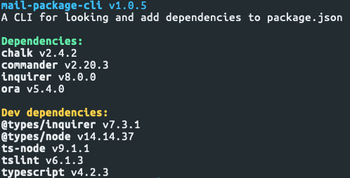

# package-cli
A CLI to show and add dependencies to package.json

[See on npmjs.com](https://www.npmjs.com/package/mail-package-cli)



## Install
Via npm
```bash
$ npm i -g mail-package-cli
```

## Usage
Via npm
```bash
$ mail-package-cli
```
Via npx
```bash
$ npx mail-package-cli
```

## Commands
### info
A command to show specified project info, and it's dependencies

```bash
$ mail-package-cli info
```

### install
A command to search and install new dependency to specified project with npm

```bash
$ mail-package-cli install
```

## Options
```bash
-p, --path <path> # specify project path
-v, --version # show current package version
-h, --help # show help
```

